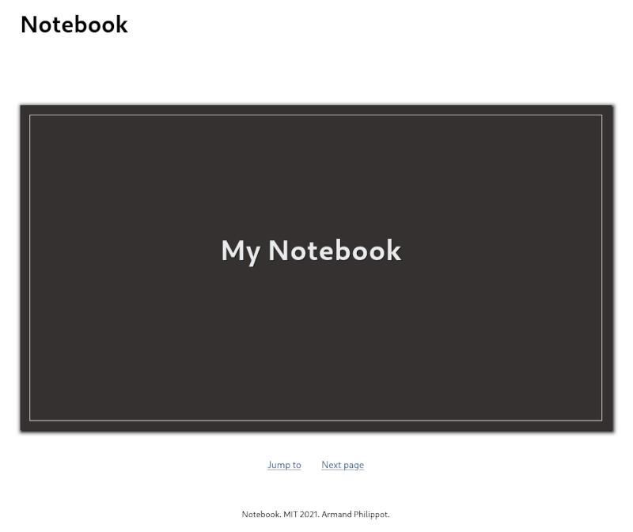

# React Notebook

A notebook implementation with React.

## Requirements

- Yarn

## How to

### Start the development version

`yarn run start`

### Start the build version:

1. `yarn run build`
2. (`yarn global add serve`)
3. `serve -s build`

## Previews

| Cover | Page |
| --- | --- |
|  |  |

## License

This project is open source and available under the [MIT license](../LICENSE).
