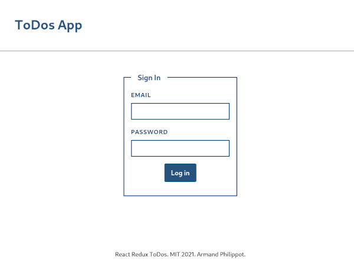

# React Redux ToDos

A ToDo app implementation with React and Redux.

## Description

This a simple ToDo application used to learn Redux.

The app has different views:

- login (and a logout link)
- a todos list where user can add new todos and mark them as done
- a single todo view where user can see todo details and edit data
- an account view

## Requirements

- Yarn

## How to

### Start the development version

`yarn run start`

### Start the build version:

1. `yarn run build`
2. (`yarn global add serve`)
3. `serve -s build`

## Login

User: `demo@email.com`

Password: `demo`

## Preview

You can see a live preview here: https://demo.armandphilippot.com/#todos

| Todos list | Single todo |
| --- | --- |
|  |  |

| Login Page | Account Page |
| --- | --- |
|  |  |

## Disclaimer

This app is not intended to be used. There is no registration form and password encryption is not implemented. The only user available is a demo user.

## License

This project is open-source and available under [MIT license](../LICENSE).
